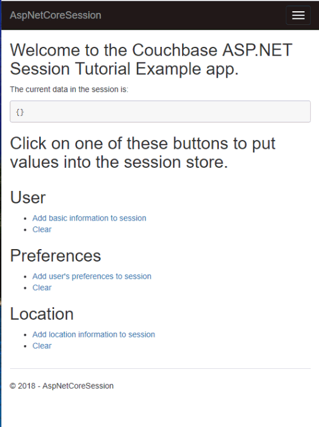

= Using Couchbase Server as a Session Store

== Overview

This tutorial contains four main sections:

* <<What is a session store?>> If you're new to session stores, this section discusses the how/why of sessions.
* <<How to Setup and Configure a Couchbase Cluster>>. Start here if you've never setup Couchbase before.
* <<Web server integration>>. Once you have a Couchbase Cluster set up, this tutorial will show how to integrate it with ASP.NET Core.
* <<Exploring Session Data>>. In contrast to many other session storage options, Couchbase has unique capabilities for exploring session data and gaining insights into your users and customers.

++++
<link rel="canonical" href="http://docs.couchbase.com/tutorials/session-storage-tutorial/dotnet.html" />
++++

== What is a session store?

Web applications are session-oriented. When a user logs in to a site, for example, they start a "session". When the user logs out (or the session times out, more commonly), the session ends.

=== What is stored in session?

Any state that a user needs can be stored in session. It could be as minimal as the user's name. User preferences can also be stored in session: language, preferred retail location, invitation/coupon codes, and more.

Some more examples of data you might put in a session store:

* Shopping carts / baskets (for ecommerce)
* Ticket selections (for events/ticket sales)
* Bet slips (as you build before you submit)
* Cookie tracking
* Browse-back (to keep track of where a user came from)
* Site activity tracking (to watch a customer's journey on your site)

=== Why do I need one?

Because HTTP is "stateless", a web application needs to store session-related data somewhere. By default, session data is usually stored in memory on the web server. However, if the web server goes down or is restarted, that session information is wiped out. To prevent this, session data can be stored elsewhere.

=== Session storage with web farms

Another reason to store session data elsewhere is because of web farms. In the below diagram, an ASP.NET web application is being scaled horizontally. Incoming HTTP requests are routed through a load balancer.

image:../assets/images/00101-session-diagram.png[Session storage diagram]

If session data is stored on the web server _itself_, then a single user can only interact with a single server. The load balancer must send the user to the same server every time. This is known as "sticky sessions".

Sticky sessions can be problematic, so using a shared location for data avoids the need for sticky sessions.

=== Why Couchbase is a good choice for a Session Store

Couchbase Server is an ideal choice for a session store.

* Performance: Couchbase Server has a memory-first architecture. Data can be retrieved with very low latency. This is important because session data is often retrieved on every page.

* Flexibility: Session data can vary a lot depeding on the needs of different parts of the web site.

* TTL: Data stored in Couchbase can be easily configured to expire after a set period of time with time-to-live (TTL).

== How to Setup and Configure a Couchbase Cluster

To use Couchbase as a session store, you must first install Couchbase (somewhere). Then, you must set up the Couchbase cluster. Finally, you'll need to create a bucket to store the session data.

=== Installing Couchbase Server

There are a number of options for getting started with Couchbase Server:

* Directly on your computer: follow the link:https://docs.couchbase.com/server/6.0/install/install-intro.html[Install] guide.
* Docker: follow the link:https://docs.couchbase.com/server/6.0/getting-started/do-a-quick-install.html[Quick Install] guide
* Kubernetes or OpenShift: use the link:https://docs.couchbase.com/operator/1.0/install-kubernetes.html[Couchbase Autonomous Operator] to create and manage a Couchbase cluster.
* Cloud: Couchbase has partnered with link:https://www.couchbase.com/partners/amazon[Amazon AWS], link:https://www.couchbase.com/partners/microsoft[Microsoft Azure], and link:https://www.couchbase.com/partners/google[Google Cloud Platform]

=== Setting up Couchbase Server

If you are using the Kubernetes operator, it will do the setup work for you.

Otherwise, you will need to start by accessing the Couchbase Server Console with a web browser on port 8091 (for example, \http://localhost:8091). Once there, you will see a "Welcome" screen that will start to walk you through the process of setting up a new cluster. For complete details, check out the link:https://docs.couchbase.com/server/6.0/manage/manage-nodes/create-cluster.html[Create Cluster] documentation.

Note that you can also set up Couchbase by using link:https://docs.couchbase.com/server/6.0/cli/cli-intro.html[command line tools] and/or link:https://docs.couchbase.com/server/6.0/rest-api/rest-intro.html[a REST API] instead of the UI. Using the UI for this tutorial will help you get comfortable with Couchbase, but in the long run you may want to script/automate cluster management using CLI/REST.

=== Creating a bucket

Couchbase clusters contain link:https://docs.couchbase.com/server/6.0/learn/buckets-memory-and-storage/buckets.html[buckets], which are a collection of key/value pairs.

To store session data, you need at least one bucket. In the Couchbase Server Console, navigate to "Buckets" and then "Add Bucket". Give it whatever name you'd like, for example "mySessionStore".

Two important factors that this tutorial will touch on is bucket types: "Ephemeral vs Couchbase". This tutorial will also touch on replication, briefly.

For more details on how to create a bucket and all of the advanced settings, check out the link:https://docs.couchbase.com/server/6.0/manage/manage-buckets/create-bucket.html[Create Bucket] documentation.

==== Couchbase vs Ephemeral

There are two kinds of buckets you can use for a session store:

* Couchbase: this is the default bucket type. Data is stored in memory as well as disk. If memory is full, items are ejected from RAM, but can still be accessed from disk when needed.
* Ephemeral: this is a memory-only bucket. You can avoid the overhead of disk access, but if memory is full, then there is nowhere else to store data. You can configure items to be rejected or you can forbid additional data being added.

There's actually a third kind of bucket: Memcached. These are also memory-only buckets. If memory is full, items will be ejected to make room as new items are added. Unless you need Memcached compatibility, you are better off using Couchbase or Ephemeral buckets.

For more details about the different bucket types, check out link:https://docs.couchbase.com/server/6.0/learn/buckets-memory-and-storage/buckets.html[Buckets] in the Couchbase documentation.

==== Replication

To start with, your Couchbase Server cluster may only consist of a single instance of Couchbase Server. One of Couchbase Server's strengths is its ability to horizontally scale to accomodate large scale applications. As you add more "nodes" to a cluster, you gain the ability to *replicate* data across the cluster. This means that if a single node goes down, you can (automatically) recover data from replicas.

When creating a bucket, if you enable replicas, then you will need to select how many total replicas you want: "1", "2", or "3". Note that you will need to have at least that many servers for replication to work properly.

== Web server integration

Session stores can take several different forms. Most commonly, integration between a persistence tool (aka a database like Couchbase) and web framework software (like ASP.NET, Spring, Express, etc).

=== Web frameworks

Web frameworks are the tools that developers typically use to create web sites. They may serve up dynamically generated content (e.g. HTML), static content (e.g. CSS/JS/images), or they may directly serve data (e.g. JSON over HTTP/REST).

In this tutorial, we'll look at how to use Couchbase as a session store for an ASP.NET Core website.

=== ASP.NET Session Storage Integration

The complete source code for this example is link:https://github.com/couchbaselabs/tutorials-contrib/tree/master/modules/session-storage/examples/AspNetCoreSession[available on GitHub] if you'd like to follow along.

To start with, let's create a brand new ASP.NET Core project in Visual Studio or Visual Studio Code. I've used the standard *Web Application (Model-View-Controller)* template.

Follow these steps to setup ASP.NET Core session as well as using Couchbase as a session store.

First, in Startup.cs, in the `Configure` function, tell ASP.NET Core to use session:

[source,C#,indent=0]
----
include::../examples/AspNetCoreSession/AspNetCoreSession/Startup.cs[tag=usesession]
----

Next, install the `Couchbase.Extensions.Session` package using NuGet. You can do this via the NuGet UI or simply enter `Install-Package Couchbase.Extensions.Session` in the Package Manager Console.

After that is installed, we'll use this extension to tell ASP.NET Core where an how to use Couchbase as a session store. Recall that I created a bucket named "mySessionStore" earlier. You should also know the location and credentials for your Couchbase cluster. To tell ASP.NET Core about Couchbase, add this code to `ConfigureServices` in Startup.cs.

[source,C#,indent=0]
----
include::../examples/AspNetCoreSession/AspNetCoreSession/Startup.cs[tag=couchbase]
----

The `AddCouchbase` simply makes Couchbase available to other services in the ASP.NET Core application. In the above example, I hardcoded the cluster location and credentials, but you can also use a config file.

The `AddDistributedCouchbaseCache` sets up ASP.NET Core to use Couchbase as a cache. This is a prerequisite to using the session store, but it can also be used by itself for any caching use cases you have.

Finally, the last part of configuration is to tell ASP.NET to use Couchbase for session storage.

[source,C#,indent=0]
----
include::../examples/AspNetCoreSession/AspNetCoreSession/Startup.cs[tag=session]
----

You can specify options like session timeout and cookie name here. In this example, session will timeout after not being used for 20 minutes, and the corresponding cookie will be called ".MyApp.Cookie". At this point, your ASP.NET Core application is ready to read and write session store.

=== Reading/writing from session

Let's start by writing to session.

In the sample application, there are three different types of session objects that a given user may store: User, Preferences, Location. `User` stores username as well as SMS number. `Preferences` stores region and employer. `Location` stores address and latitude/longitude. I chose to model these as three different session objects. In your application, you may want to break up different areas of session, as not all users will need every session object. For instance, a customer who is visiting your site may need browse-back and site activity tracking data, but may not need any shopping cart data until they put the first item into their cart.

To store an item in session, use `HttpContext.Session.SetObject`. Here's an example of the "User" session data being stored:

[source,C#,indent=0]
----
include::../examples/AspNetCoreSession/AspNetCoreSession/Controllers/HomeController.cs[tag=setuser]
----

To retrieve an item from session, use `HttpContext.Session.GetObject`. Here's an example of the "User" session data being retrieved:

[source,C#,indent=0]
----
include::../examples/AspNetCoreSession/AspNetCoreSession/Controllers/HomeController.cs[tag=getuser]
----

_Notes:_

* When storing data, the example is using an anonymous type. This could be replaced with a defined C# type instead.
* When retrieve data, the example is using `dynamic`. If using a type to set data, you can also use that same type when getting.
* `_faker` is being used to set random data to these session objects for example purposes.

Finally, though session data will be erased automatically after 20 minutes, you can also elect to clear session data at any time by using `HttpContext.Session.Remove`:

[source,C#,indent=0]
----
include::../examples/AspNetCoreSession/AspNetCoreSession/Controllers/HomeController.cs[tag=clearuser]
----

Putting these all together, the example application is able to create objects, read objects, and remove objects from session storage:

== Exploring Session Data

interesting n1ql queries on session data

== Links to more session storage resources

https://github.com/couchbaselabs/couchbase-aspnet/
https://github.com/couchbaselabs/Couchbase.Extensions/blob/master/docs/session.md
https://blog.couchbase.com/distributed-session-aspnet-couchbase/ 
